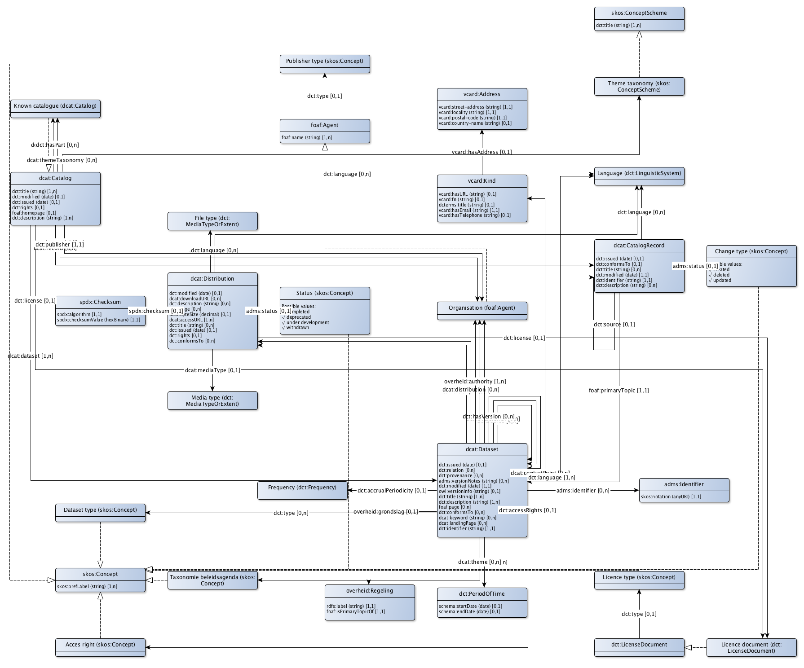

# Profile documentation

This page described the DCAT Applicatie profiel NL version 1.1 as specified in: [https://data.overheid.nl/IPM-Datamodel](https://data.overheid.nl/IPM-Datamodel).

## Vocabularies and namespaces

The following vocabularies are used:

|prefix|namespace|documentation
|---|---|---
|adms|http://www.w3.org/ns/adms#|
|dcat|http://www.w3.org/ns/dcat#|
|dct|http://purl.org/dc/terms/|
|foaf|http://xmlns.com/foaf/0.1/|
|overheid|http://standaarden.overheid.nl/owms/terms/|
|owl|http://www.w3.org/2002/07/owl#|
|rdfs|http://www.w3.org/2000/01/rdf-schema#|
|schema|http://schema.org/|
|skos|http://www.w3.org/2004/02/skos/core#|
|spdx|http://spdx.org/rdf/terms#|
|vcard|http://www.w3.org/2006/vcard/ns#|

## Classes

The profile contains classes that are considered core to the profile and are part of the catalog core. Other classes are only used by reference and are stable with respect to the operational data ("Master data"). And some classes are merly used as complex datatypes.

### Core classes

|core classes|definition
|---|---
|[dcat:CatalogRecord](http://www.w3.org/ns/dcat#CatalogRecord)|
|[dcat:Dataset](http://www.w3.org/ns/dcat#Dataset)|
|[dcat:Distribution](http://www.w3.org/ns/dcat#Distribution)|

### Reference classes

|reference classes|definition
|---|---
|[dct:Frequency](http://purl.org/dc/terms/Frequency)|
|[dct:LicenseDocument](http://purl.org/dc/terms/LicenseDocument)|
|[dct:LinguisticSystem](http://purl.org/dc/terms/LinguisticSystem)|
|[dct:Location](http://purl.org/dc/terms/Location)|
|[dct:MediaTypeOrExtent](http://purl.org/dc/terms/MediaTypeOrExtent)|
|[dct:RightsStatement](http://purl.org/dc/terms/RightsStatement)|
|[overheid:Juriconnectverwijzing](http://standaarden.overheid.nl/owms/terms/Juriconnectverwijzing)|
|[overheid:Regeling](http://standaarden.overheid.nl/owms/terms/Regeling)|
|[skos:Concept](http://www.w3.org/2004/02/skos/core#Concept)|
|[skos:Concept](http://www.w3.org/2004/02/skos/core#Concept)|
|[skos:Concept](http://www.w3.org/2004/02/skos/core#Concept)|
|[skos:Concept](http://www.w3.org/2004/02/skos/core#Concept)|
|[skos:Concept](http://www.w3.org/2004/02/skos/core#Concept)|
|[skos:Concept](http://www.w3.org/2004/02/skos/core#Concept)|
|[skos:ConceptScheme](http://www.w3.org/2004/02/skos/core#ConceptScheme)|
|[dcat:Catalog](http://www.w3.org/ns/dcat#Catalog)|
|[foaf:Agent](http://xmlns.com/foaf/0.1/Agent)|

### Datatype classes

|datatype classes|definition
|---|---
|[dct:PeriodOfTime](http://purl.org/dc/terms/PeriodOfTime)|
|[dct:ProvenanceStatement](http://purl.org/dc/terms/ProvenanceStatement)|
|[dct:Standard](http://purl.org/dc/terms/Standard)|
|[spdx:Checksum](http://spdx.org/rdf/terms#Checksum)|
|[rdfs:Literal](http://www.w3.org/2000/01/rdf-schema#Literal)|
|[rdfs:Resource](http://www.w3.org/2000/01/rdf-schema#Resource)|
|[owl:Individual](http://www.w3.org/2002/07/owl#Individual)|
|[vcard:Kind](http://www.w3.org/2006/vcard/ns#Kind)|
|[adms:Identifier](http://www.w3.org/ns/adms#Identifier)|
|[foaf:Document](http://xmlns.com/foaf/0.1/Document)|

## Catalog

|property|range|definition
|---|---|---
|[dcat:dataset](http://www.w3.org/ns/dcat#dataset)|[dcat:Dataset](http://www.w3.org/ns/dcat#Dataset)|Vreemde omgekeerde Detail-Master relatie?Bovendien nasty term voor property "dcat:dataset" met kleine letter verschilt niet echt van term voor class "dcat:Dataset"
|[dct:description](http://purl.org/dc/terms/description)|[rdfs:Literal](http://www.w3.org/2000/01/rdf-schema#Literal)|
|[dct:publisher](http://purl.org/dc/terms/publisher)|[foaf:Agent](http://xmlns.com/foaf/0.1/Agent)|
|[dct:title](http://purl.org/dc/terms/title)|[rdfs:Literal](http://www.w3.org/2000/01/rdf-schema#Literal)|
|[foaf:homepage](http://xmlns.com/foaf/0.1/homepage)|[foaf:Document](http://xmlns.com/foaf/0.1/Document)|
|[dct:language](http://purl.org/dc/terms/language)|[dct:LinguisticSystem](http://purl.org/dc/terms/LinguisticSystem)|
|[dct:license](http://purl.org/dc/terms/license)|[dct:LicenseDocument](http://purl.org/dc/terms/LicenseDocument)|
|[dct:issued](http://purl.org/dc/terms/issued)|[rdfs:Literal](http://www.w3.org/2000/01/rdf-schema#Literal)|
|[dcat:themeTaxonomy](http://www.w3.org/ns/dcat#themeTaxonomy)|[skos:ConceptScheme](http://www.w3.org/2004/02/skos/core#ConceptScheme)|DCAT-EU specificeert de naam van de CV zelf, niet de waarden in de lijst.
|[dct:modified](http://purl.org/dc/terms/modified)|[rdfs:Literal](http://www.w3.org/2000/01/rdf-schema#Literal)|
|[dct:hasPart](http://purl.org/dc/terms/hasPart)|[dcat:Catalog](http://www.w3.org/ns/dcat#Catalog)|
|[dct:isPartOf](http://purl.org/dc/terms/isPartOf)|[dcat:Catalog](http://www.w3.org/ns/dcat#Catalog)|
|[dcat:record](http://www.w3.org/ns/dcat#record)|[dcat:CatalogRecord](http://www.w3.org/ns/dcat#CatalogRecord)|Vreemde omgekeerde Detail-Master relatie?
|[dct:rights](http://purl.org/dc/terms/rights)|[dct:RightsStatement](http://purl.org/dc/terms/RightsStatement)|
|[dct:spatial](http://purl.org/dc/terms/spatial)|[dct:Location](http://purl.org/dc/terms/Location)|

## Catalog record

|property|range|definition
|---|---|---
|[foaf:primaryTopic](http://xmlns.com/foaf/0.1/primaryTopic)|[dcat:Dataset](http://www.w3.org/ns/dcat#Dataset)|Wow! elk catalog record hoort bij precies 1 Dataset
|[dct:modified](http://purl.org/dc/terms/modified)|[rdfs:Literal](http://www.w3.org/2000/01/rdf-schema#Literal)|
|[dct:conformsTo](http://purl.org/dc/terms/conformsTo)|[rdfs:Resource](http://www.w3.org/2000/01/rdf-schema#Resource)|
|[adms:status](http://www.w3.org/ns/adms#status)|[skos:Concept](http://www.w3.org/2004/02/skos/core#Concept)|This property refers to the type of the latest revision of a Dataset's entry in the Catalogue. It MUST take one of the values :created, :updated or :deleted depending on whether this latest revision is a result of a creation, update or deletion.
|[adms:status](http://www.w3.org/ns/adms#status)|[skos:Concept](http://www.w3.org/2004/02/skos/core#Concept)|This property refers to the type of the latest revision of a Dataset's entry in the Catalogue. It MUST take one of the values :created, :updated or :deleted depending on whether this latest revision is a result of a creation, update or deletion.
|[adms:status](http://www.w3.org/ns/adms#status)|[skos:Concept](http://www.w3.org/2004/02/skos/core#Concept)|This property refers to the type of the latest revision of a Dataset's entry in the Catalogue. It MUST take one of the values :created, :updated or :deleted depending on whether this latest revision is a result of a creation, update or deletion.
|[adms:status](http://www.w3.org/ns/adms#status)|[skos:Concept](http://www.w3.org/2004/02/skos/core#Concept)|This property refers to the type of the latest revision of a Dataset's entry in the Catalogue. It MUST take one of the values :created, :updated or :deleted depending on whether this latest revision is a result of a creation, update or deletion.
|[adms:status](http://www.w3.org/ns/adms#status)|[skos:Concept](http://www.w3.org/2004/02/skos/core#Concept)|This property refers to the type of the latest revision of a Dataset's entry in the Catalogue. It MUST take one of the values :created, :updated or :deleted depending on whether this latest revision is a result of a creation, update or deletion.
|[adms:status](http://www.w3.org/ns/adms#status)|[skos:Concept](http://www.w3.org/2004/02/skos/core#Concept)|This property refers to the type of the latest revision of a Dataset's entry in the Catalogue. It MUST take one of the values :created, :updated or :deleted depending on whether this latest revision is a result of a creation, update or deletion.
|[dct:issued](http://purl.org/dc/terms/issued)|[rdfs:Literal](http://www.w3.org/2000/01/rdf-schema#Literal)|
|[dct:description](http://purl.org/dc/terms/description)|[rdfs:Literal](http://www.w3.org/2000/01/rdf-schema#Literal)|
|[dct:language](http://purl.org/dc/terms/language)|[dct:LinguisticSystem](http://purl.org/dc/terms/LinguisticSystem)|
|[dct:source](http://purl.org/dc/terms/source)|[dcat:CatalogRecord](http://www.w3.org/ns/dcat#CatalogRecord)|
|[dct:title](http://purl.org/dc/terms/title)|[rdfs:Literal](http://www.w3.org/2000/01/rdf-schema#Literal)|

## Dataset

|property|range|definition
|---|---|---
|[dct:identifier](http://purl.org/dc/terms/identifier)|[rdfs:Literal](http://www.w3.org/2000/01/rdf-schema#Literal)|Verplicht vanwege het grote belang voor ontdubbelen. Globaal unieke identificatie van de dataset, toegekend door de eerste catalogus waarin de dataset wordt beschreven. Op basis van deze identifier worden duplicaten opgespoord. (Zie https://joinup.ec.europa.eu/release/dcat-ap-how-manage-duplicates).
|[dct:description](http://purl.org/dc/terms/description)|[rdfs:Literal](http://www.w3.org/2000/01/rdf-schema#Literal)|
|[dct:title](http://purl.org/dc/terms/title)|[rdfs:Literal](http://www.w3.org/2000/01/rdf-schema#Literal)|
|[dct:language](http://purl.org/dc/terms/language)|[dct:LinguisticSystem](http://purl.org/dc/terms/LinguisticSystem)|Verplicht in OWMS
|[dct:modified](http://purl.org/dc/terms/modified)|[rdfs:Literal](http://www.w3.org/2000/01/rdf-schema#Literal)|Verplicht in OWMS
|[dcat:contactPoint](http://www.w3.org/ns/dcat#contactPoint)|[vcard:Kind](http://www.w3.org/2006/vcard/ns#Kind)|
|[dcat:distribution](http://www.w3.org/ns/dcat#distribution)|[dcat:Distribution](http://www.w3.org/ns/dcat#Distribution)|Vreemde omgekeerde Detail-Master relatie?
|[dcat:keyword](http://www.w3.org/ns/dcat#keyword)|[rdfs:Literal](http://www.w3.org/2000/01/rdf-schema#Literal)|
|[dct:publisher](http://purl.org/dc/terms/publisher)|[foaf:Agent](http://xmlns.com/foaf/0.1/Agent)|
|[dcat:theme](http://www.w3.org/ns/dcat#theme)|[skos:Concept](http://www.w3.org/2004/02/skos/core#Concept)|
|[dcat:theme](http://www.w3.org/ns/dcat#theme)|[skos:Concept](http://www.w3.org/2004/02/skos/core#Concept)|
|[dcat:theme](http://www.w3.org/ns/dcat#theme)|[skos:Concept](http://www.w3.org/2004/02/skos/core#Concept)|
|[dcat:theme](http://www.w3.org/ns/dcat#theme)|[skos:Concept](http://www.w3.org/2004/02/skos/core#Concept)|
|[dcat:theme](http://www.w3.org/ns/dcat#theme)|[skos:Concept](http://www.w3.org/2004/02/skos/core#Concept)|
|[dcat:theme](http://www.w3.org/ns/dcat#theme)|[skos:Concept](http://www.w3.org/2004/02/skos/core#Concept)|
|[dcat:landingPage](http://www.w3.org/ns/dcat#landingPage)|[foaf:Document](http://xmlns.com/foaf/0.1/Document)|De landing page is belangrijker dan de documentation
|[dct:spatial](http://purl.org/dc/terms/spatial)|[dct:Location](http://purl.org/dc/terms/Location)|Verplicht indien van toepassing vanwege OWMS
|[dct:temporal](http://purl.org/dc/terms/temporal)|[dct:PeriodOfTime](http://purl.org/dc/terms/PeriodOfTime)|Kun je meerdere perioden ondersteunen? Lijkt weinig behoefte aan. 1 periode kunje ondersteuenen met startdate/endDate. Verplicht indien van toepassing vanwege OWMS
|[overheid:authority](http://standaarden.overheid.nl/owms/terms/authority)|[foaf:Agent](http://xmlns.com/foaf/0.1/Agent)|Nodig voor OWMS
|[dct:accessRights](http://purl.org/dc/terms/accessRights)|[dct:RightsStatement](http://purl.org/dc/terms/RightsStatement)|In DCAT-NL 1.0 dct:rights (van Distribution). In DCAT-EU 1.1 dct:accessRights
|[dct:conformsTo](http://purl.org/dc/terms/conformsTo)|[dct:Standard](http://purl.org/dc/terms/Standard)|
|[foaf:page](http://xmlns.com/foaf/0.1/page)|[foaf:Document](http://xmlns.com/foaf/0.1/Document)|
|[dct:accruelPeriodicity](http://purl.org/dc/terms/accruelPeriodicity)|[dct:Frequency](http://purl.org/dc/terms/Frequency)|
|[dct:hasVersion](http://purl.org/dc/terms/hasVersion)|[dcat:Dataset](http://www.w3.org/ns/dcat#Dataset)|
|[dct:isVersionOf](http://purl.org/dc/terms/isVersionOf)|[dcat:Dataset](http://www.w3.org/ns/dcat#Dataset)|
|[adms:identifier](http://www.w3.org/ns/adms#identifier)|[adms:Identifier](http://www.w3.org/ns/adms#Identifier)|
|[dct:provenance](http://purl.org/dc/terms/provenance)|[dct:ProvenanceStatement](http://purl.org/dc/terms/ProvenanceStatement)|
|[dct:relation](http://purl.org/dc/terms/relation)|[rdfs:Resource](http://www.w3.org/2000/01/rdf-schema#Resource)|
|[dct:dct:issued](http://purl.org/dc/terms/dct:issued)|[rdfs:Literal](http://www.w3.org/2000/01/rdf-schema#Literal)|
|[adms:sample](http://www.w3.org/ns/adms#sample)|[dcat:Distribution](http://www.w3.org/ns/dcat#Distribution)|
|[dct:source](http://purl.org/dc/terms/source)|[dcat:Dataset](http://www.w3.org/ns/dcat#Dataset)|
|[dct:type](http://purl.org/dc/terms/type)|[skos:Concept](http://www.w3.org/2004/02/skos/core#Concept)|
|[dct:type](http://purl.org/dc/terms/type)|[skos:Concept](http://www.w3.org/2004/02/skos/core#Concept)|
|[dct:type](http://purl.org/dc/terms/type)|[skos:Concept](http://www.w3.org/2004/02/skos/core#Concept)|
|[dct:type](http://purl.org/dc/terms/type)|[skos:Concept](http://www.w3.org/2004/02/skos/core#Concept)|
|[dct:type](http://purl.org/dc/terms/type)|[skos:Concept](http://www.w3.org/2004/02/skos/core#Concept)|
|[dct:type](http://purl.org/dc/terms/type)|[skos:Concept](http://www.w3.org/2004/02/skos/core#Concept)|
|[owl:versionInfo](http://www.w3.org/2002/07/owl#versionInfo)|[rdfs:Literal](http://www.w3.org/2000/01/rdf-schema#Literal)|
|[adms:versionNotes](http://www.w3.org/ns/adms#versionNotes)|[rdfs:Literal](http://www.w3.org/2000/01/rdf-schema#Literal)|
|[overheid:grondslag](http://standaarden.overheid.nl/owms/terms/grondslag)|[overheid:Regeling](http://standaarden.overheid.nl/owms/terms/Regeling)|Toegevoegd aan nDCAT-AP-NL. Maakt het mogelijk om datasets te linken aan wet- en regelgeving
|[overheid:doel](http://standaarden.overheid.nl/owms/terms/doel)|[rdfs:Literal](http://www.w3.org/2000/01/rdf-schema#Literal)|Wel DONL, niet DCAT-NL
|[overheid:kwaliteit](http://standaarden.overheid.nl/owms/terms/kwaliteit)|[rdfs:Literal](http://www.w3.org/2000/01/rdf-schema#Literal)|Wel DONL, niet DCAT-NL
|[overheid:LODStars](http://standaarden.overheid.nl/owms/terms/LODStars)|[rdfs:Literal](http://www.w3.org/2000/01/rdf-schema#Literal)|Wel DONL, niet DCAT-NL

## Distribution

|property|range|definition
|---|---|---
|[dcat:accessURL](http://www.w3.org/ns/dcat#accessURL)|[rdfs:Resource](http://www.w3.org/2000/01/rdf-schema#Resource)|
|[dct:description](http://purl.org/dc/terms/description)|[rdfs:Literal](http://www.w3.org/2000/01/rdf-schema#Literal)|
|[dct:format](http://purl.org/dc/terms/format)|[dct:MediaTypeOrExtent](http://purl.org/dc/terms/MediaTypeOrExtent)|
|[dct:license](http://purl.org/dc/terms/license)|[dct:LicenseDocument](http://purl.org/dc/terms/LicenseDocument)|In DCAT-NL 1.0 onterecht property van Dataset.
|[dcat:byteSize](http://www.w3.org/ns/dcat#byteSize)|[rdfs:Literal](http://www.w3.org/2000/01/rdf-schema#Literal)|
|[spdx:checksum](http://spdx.org/rdf/terms#checksum)|[spdx:Checksum](http://spdx.org/rdf/terms#Checksum)|
|[foaf:page](http://xmlns.com/foaf/0.1/page)|[foaf:Document](http://xmlns.com/foaf/0.1/Document)|
|[dcat:downloadURL](http://www.w3.org/ns/dcat#downloadURL)|[rdfs:Resource](http://www.w3.org/2000/01/rdf-schema#Resource)|
|[dct:language](http://purl.org/dc/terms/language)|[dct:LinguisticSystem](http://purl.org/dc/terms/LinguisticSystem)|
|[dct:conformsTo](http://purl.org/dc/terms/conformsTo)|[dct:Standard](http://purl.org/dc/terms/Standard)|
|[dcat:mediaType](http://www.w3.org/ns/dcat#mediaType)|[dct:MediaTypeOrExtent](http://purl.org/dc/terms/MediaTypeOrExtent)|In DCAT-NL 1.0 onterecht property van Dataset.
|[dct:issued](http://purl.org/dc/terms/issued)|[rdfs:Literal](http://www.w3.org/2000/01/rdf-schema#Literal)|
|[dct:rights](http://purl.org/dc/terms/rights)|[dct:RightsStatement](http://purl.org/dc/terms/RightsStatement)|In DCAT-NL 1.0 onterecht property van Dataset.
|[adms:status](http://www.w3.org/ns/adms#status)|[skos:Concept](http://www.w3.org/2004/02/skos/core#Concept)|
|[adms:status](http://www.w3.org/ns/adms#status)|[skos:Concept](http://www.w3.org/2004/02/skos/core#Concept)|
|[adms:status](http://www.w3.org/ns/adms#status)|[skos:Concept](http://www.w3.org/2004/02/skos/core#Concept)|
|[adms:status](http://www.w3.org/ns/adms#status)|[skos:Concept](http://www.w3.org/2004/02/skos/core#Concept)|
|[adms:status](http://www.w3.org/ns/adms#status)|[skos:Concept](http://www.w3.org/2004/02/skos/core#Concept)|
|[adms:status](http://www.w3.org/ns/adms#status)|[skos:Concept](http://www.w3.org/2004/02/skos/core#Concept)|
|[dct:title](http://purl.org/dc/terms/title)|[rdfs:Literal](http://www.w3.org/2000/01/rdf-schema#Literal)|
|[dct:modified](http://purl.org/dc/terms/modified)|[rdfs:Literal](http://www.w3.org/2000/01/rdf-schema#Literal)|

